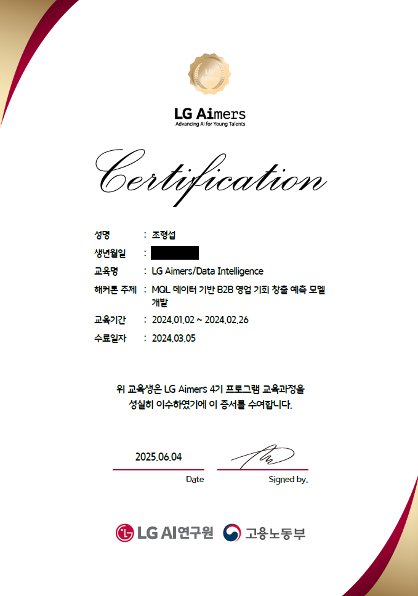

# 🚀 LGAimers 4th

**LGAimers** is an AI training and hackathon program hosted by **LG Electronics**, focusing on both theory and practical application.

## 📘 Phase 1: AI Foundation
- Ethics, linear algebra, machine learning
- Causal inference, CNNs, RNNs, NLP

## 📊 Phase 2: Real-World Project & Hackathon
- B2B customer data classification
- Predictive modeling (logistic regression, ANN)
- Final hackathon based on LG Electronics case study

---

## 💻 Hackathon

Development of a B2B Sales Opportunity Prediction Model Based on MQL Data.

### 📁 Dataset (Private)  
Source: [https://lgaimers.ai/](https://lgaimers.ai/)

- `train.csv`: Training dataset containing customer features and a target label (e.g., success/failure of a campaign).
- `submission.csv`: Test dataset with the same structure but without labels, used for generating final predictions.

> 📌 Note: The dataset is proprietary and not publicly available.

### 🧹 Preprocessing

1. **Missing Values Handling**
   - Missing values are filled with 0.
   - An alternative method (backfill) is also included but commented out.

2. **Categorical Data Encoding**
   - Categorical (object) columns are encoded using a custom label encoding function.
   - Optionally, object-type columns can be dropped (code commented out).

### 🧠 Models Used

The following machine learning models were used and compared for the classification task:

- `DecisionTreeClassifier`
- `SVC` (Support Vector Classifier)
- `AdaBoostClassifier`
- `GradientBoostingClassifier`
- `XGBClassifier` (XGBoost)
- `SGDClassifier` (Stochastic Gradient Descent)
- `LGBMClassifier` (LightGBM)
- `RandomForestClassifier`
- `LogisticRegression`
- `VotingClassifier` (for ensemble learning)
- Basic `MLP` (Multi-Layer Perceptron)

These models were evaluated to determine the most effective approach for the given dataset.

## 🏅 Certificate of Completion

